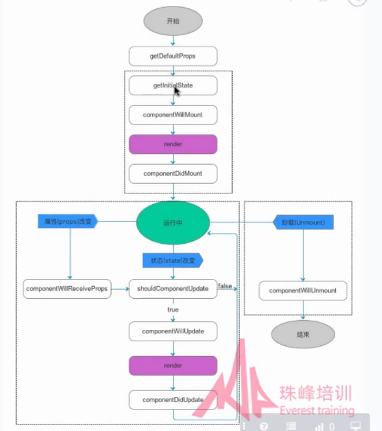

# 项目构建
- git& github
- nodejs环境
- 编辑器 atom/webstorm
- chrome
- shell
- babel preset plugin
- es6 -> es5
- webpack
- ...

## react
-  npm install webpack webpack-dev-server --save-dev
-  npm install babel babel-core babel-loader babel-preset-es2015 babel-preset-react --save-dev
   - 配置babel-loader
   ```
   module:{
           loaders: [
               {
                   test: /\.js$/,
                   loader: 'babel-loader',
                   exclude: /node_modules/
               }
           ]
       }
    ```
-  npm install react react-dom --save-dev
    ```
       {
         "presets": ["es2015", "react"]
       }
   ```
   
-  npm install style-loader css-loader --save-dev


## 组件
- 组件定义
- 数据流动
- props 组件间的数据传递
    ```
    index.js:
    const data = {
        "name": "Crystal2030",
        "id": 6970454,
        "avatar_url": "https://avatars0.githubusercontent.com/u/6970454?v=3"
    };
    
    class App extends Component {
        render () {
            return <Profile name={data.name}  id={data.id} url={data.avatar_url}/>;
        }
    }
    
    
    组件内Profile.js
    class Profile extends Component {
        render (){
            let {name, url, id} = this.props;
            console.log(name, url ,id);
            return (
                <div>
                    
                    <h1> {name} </h1>
                    <h2> {id} </h2>
                </div>
            )
        }
    }
    
    
    限定组件属性和设置默认值：
    //限定数据类型
    Profile.propTypes = {
        url: PropTypes.string,
        name: PropTypes.string,
        id: PropTypes.number.isRequired
    }
    //默认值设置
    Profile.defaultProps={
        name: 'aa',
        id: '0',
        url: ''
    }
    ```
- state 管理组件自己内部的数据
    ```
    index.js:
    
  constructor(){
        super();
        this.state = {name: 'react course'}
    }
    render () {
        return <h1>hello,  {this.state.name} </h1>
    }
    
    用setState改变state的值：
    constructor(){
        super();
        //初始的state
        //defaultProps性质一样
        this.state = {name: 'react course'}
    }
     update(e){
        this.setState({
            name: e.target.value
        })
    }
    render () {
        return (
            <div>
                <input type="text" onChange={this.update.bind(this)}/>
                <h1>hello, {this.state.name}</h1>
            </div>
        )
    }
    ```
## 改变this关键字指向
    ```
    1. 在constructor里面修改
    constructor(){
        super();
        //初始的state
        //defaultProps性质一样
        this.state = {name: 'react course'}
        // this.update = this.update.bind(this);//改变this指向， 或者可以用arrow function
    }
     2.用arrow function， 需要安装babel-preset-stage-0预设并配置来支持这种写法：
     npm install babel-preset-stage-0
     
     update = (e) =>{
         console.log(this);
         this.setState({
             name: e.target.value
         })
     }
    ```
## 使用refs操作DOM
    ```
    import ReactDOM, {render, findDOMNode} from 'react-dom';
    ...
    
    update = (e) =>{
        console.log(this.refs)
        console.log(findDOMNode(this.refs.one).value);
        this.setState({
            one: findDOMNode(this.refs.one).value,
            two: findDOMNode(this.refs.two).value,
            three: findDOMNode(this.refs.three).value,
        })
    }
    render () {
    return (
        <div>
            {/*使用refs来操作DOM*/}
            {/*<input type="text" onChange={this.update}/>*/}
            <h1>hello, {this.state.one}</h1>
            <Range ref="one" update={this.update} /> {this.state.one}
            <Range ref="two" update={this.update} />{this.state.two}
            <Range ref="three" update={this.update} />{this.state.three}
        </div>
    )
    }
    ```
## 获取子组件 this.props.children
    ```
    import React, {Component, Children} from 'react';
    import ReactDOM, {render} from 'react-dom';
    
    
    class App extends Component {
        render () {
            return (
                <div>
                    <List>
                        <a href="http://baidu.com">baidu</a>
                        <a href="http://google.com">google</a>
                    </List>
                </div>
            )
        }
    }
    
    class List extends Component{
        render(){
            console.log(Children)
            let node = Children.map(this.props.children, (item) => {
                return <li>{item}</li>
            });
            console.log(node)
            return (
                <ul>
                    {node}
                </ul>
            )
        }
    }
    render(<App/>, document.getElementById('app'));
    ```  
    
## 理解react的生命周期之创建  

